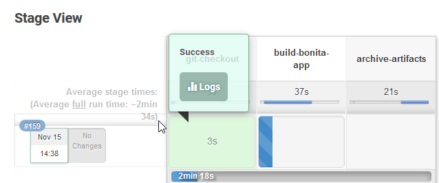
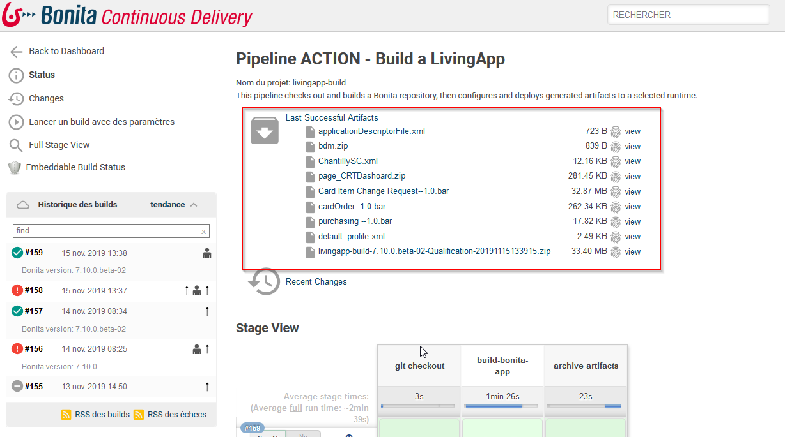
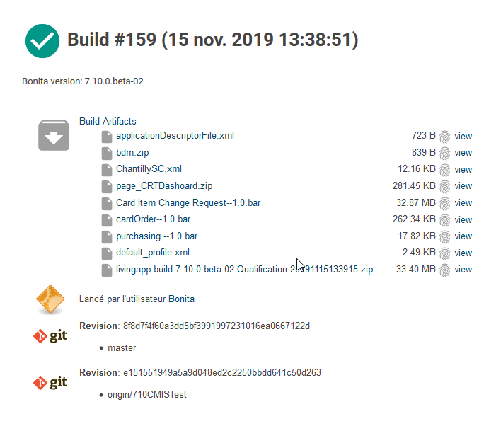
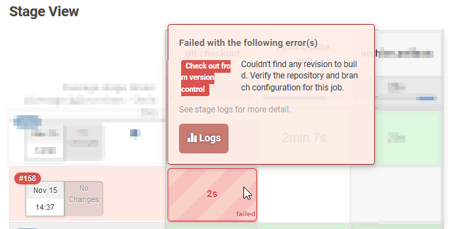
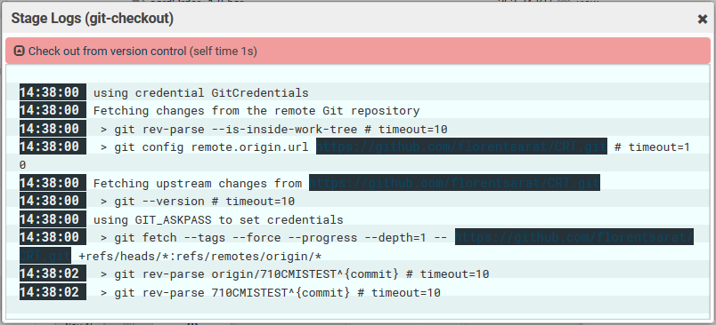

# Building a Living Application

## Build Job
The job "ACTION - Build a LivingApp" allows you build your living applications:

## Launching a build
1. Click on the  of the "ACTION - Build a LivingApp" job.
2. Your default build configuration will be pre-loaded. If needed you can change it.
3. Click on the build button (lower left).
4. You should see the job progress and steps.

## Result of a build

### Successful build
If the job is successful, you can consult and download the artifacted created from the build.

You can either see them in the job overview or the detail of the specific build job instance:
* Job Overview
::: warning
Warning if your last job fails, it will still display the last successful artifacts.
:::
  * Open the job by clicking on its title
  
  

  * In the top of the page, you will find the last successful build artefacts

  

* Job instance detail
 ::: info
 This also allows you to consult previous build result
 :::
  * Open the specific job instance by click on its ID

  

  * You can now consult the result of that job instance:
  
  

### Failed Build
If the job fails then you need to open its logs to understand the issues.

#### Example
The below build job has failed

In order to get more information on the issue, all you need to is click on the step that failed and information on the error will be displayed:

If this isn't enough than you can click on the "Logs" button to have the full logs:

